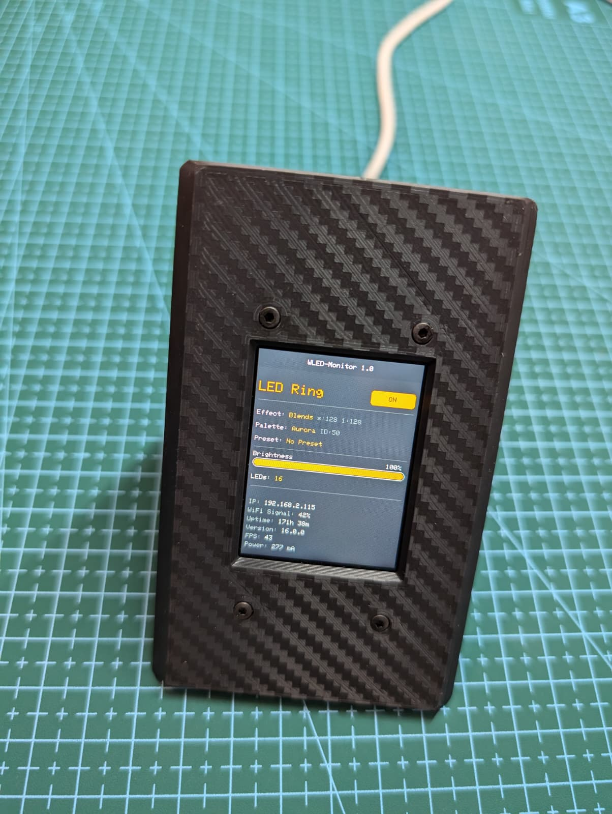
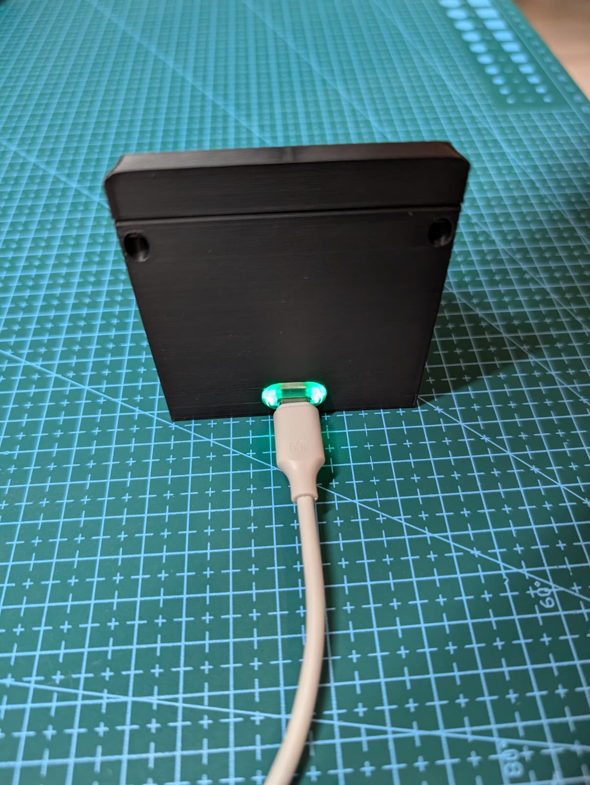
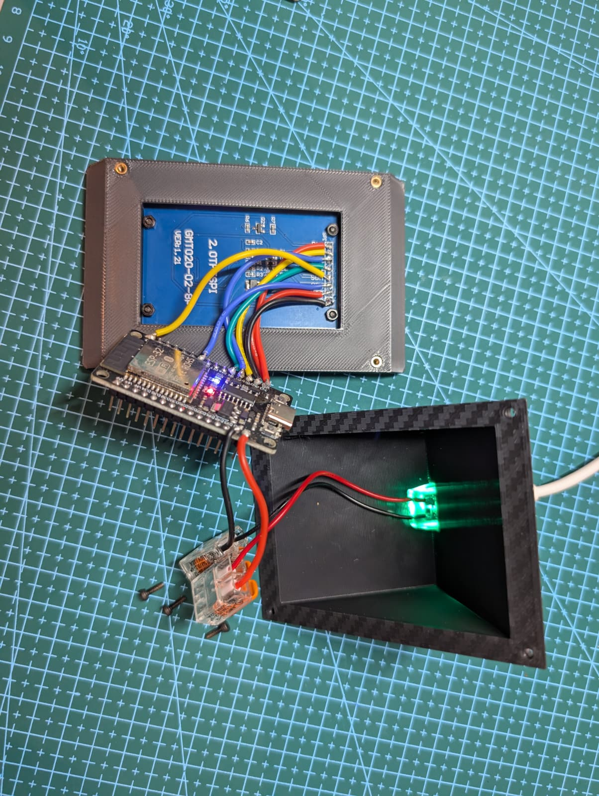

# WLED-Monitor

# ESP32 WLED Status Monitor

A compact, hardware-based monitoring solution designed to cycle through and display live statistics from multiple WLED instances across a local network. Built with an ESP32 and a vibrant 2-inch IPS TFT display, this monitor provides a sleek, real-time glance at your smart lighting setup.

## Features
* **Multi-Instance Support:** Dynamically switches and polls data from multiple WLED devices at configurable intervals (e.g., every 20 seconds).
* **Live UI Updates:** Visualizes core WLED data including power status (ON/OFF), active effects, color palettes, current presets, and custom parameters.
* **Dynamic Brightness Bar:** Renders a modern, responsive progress bar showing the live brightness percentage of the active light fixture.
* **Advanced Diagnostics:** Displays detailed system statistics at the bottom, such as Uptime, Wi-Fi signal strength (RSSI), active framerate (FPS), current power draw (mA), and Nightlight countdowns.
* **Robust Error Handling:** Features an enhanced offline recovery screen that immediately flags network dropouts, identifying the disconnected device by its configured name and IP address.
* **OTA Updates:** Integrated ArduinoOTA support for wireless firmware flashing directly over Wi-Fi.

## Hardware Components
* **Microcontroller:** ESP32 (NodeMCU / Development Board)
* **Display:** 2.0-inch SPI TFT LCD Module 
  * Resolution: 240x320 pixels
  * Driver: ST7789 (IPS panel with wide viewing angles)
  * Pinout: 7-Pin SPI (GND, VCC, SCL, SDA, RES, DC, BLK)
  * [Buy on AliExpress (Global Link)](https://www.aliexpress.com/item/1005007523612119.html)
  * *Search keywords if link expires:* `2.0 inch tft spi st7789 240x320`
* **Other hardware**
  * 8 x M2x10 Bolts
  * 4 x M2 Nuts
  * 4 x M2 Heat-Set-Inserts
  * 1 x USB-C Female port [Buy on AliExpress (Global Link)](https://www.aliexpress.com/item/1005011963865787.html)
  * 2 x 2-port WAGO connector

## Wiring
| Display Pin | ESP32 Pin | Function |
|-------------|-----------|----------|
| VCC         | 3V3       | Power    |
| GND         | GND       | Ground   |
| CS          | GPIO 15   | Chip Sel |
| DC          | GPIO 2    | Data/Cmd |
| RST         | GPIO 4    | Reset    |
| SDA (MOSI)  | GPIO 23   | SPI Data |
| SCL (CLK)   | GPIO 18   | SPI Clock|

## 3D Printed Enclosure
The 3D printing files for the custom enclosure are available as a package in the [Releases section](https://github.com/biergenuss/WLED-Monitor/tree/main/3D_Files).

### Exterior View
| Front View | Back View (USB-C Power) |
| :---: | :---: |
|  |  |

---

  

* **Recommended Print Settings:**
  * Material: PLA or PETG
  * Layer Height: 0.2mm
  * Infill: 15% - 20%
  * Supports: Not required if oriented correctly

## Software Stack & Libraries
* **Framework:** Arduino IDE / ESP32 Core
* **Graphics & Display:** `Adafruit_GFX` & `Adafruit_ST7789`
* **Data Parsing:** `ArduinoJson` (handles communication with WLED's HTTP JSON API)
* **Networking:** `WiFi`, `HTTPClient`, and `ArduinoOTA`
